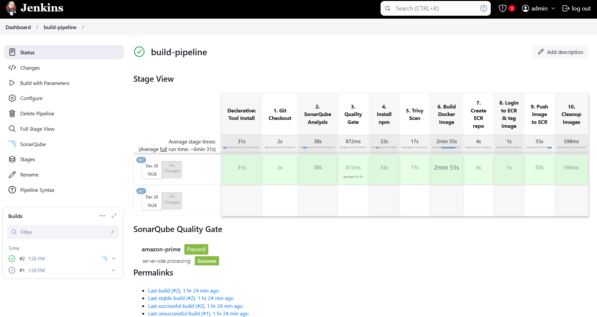

# CICD Pipeline for Amazon Prime Clone Deployment

## Project Overview
This project demonstrates deploying an Amazon Prime Clone using modern DevOps tools and practices. It showcases the implementation of a CI/CD pipeline and the deployment of the application on AWS infrastructure.

### Primary Tools Used:
- **Terraform**: Infrastructure as Code (IaC) for creating AWS infrastructure (EC2, EKS).
- **GitHub**: Version control and source code management.
- **Jenkins**: CI/CD automation for building and deploying the application.
- **SonarQube**: Static code quality analysis with quality gates.
- **NPM**: Build tool for managing NodeJS dependencies.
- **Aqua Trivy**: Security vulnerability scanner for the application.
- **Docker**: Containerization tool for creating and managing images.
- **AWS ECR**: Docker image repository for storing container images.
- **AWS EKS**: Kubernetes platform for managing containers.
- **ArgoCD**: Continuous deployment tool for Kubernetes applications.
- **Prometheus & Grafana**: Tools for monitoring, alerting, and visualization.

---

## Project Images

### Pipeline Overview

### ArgoCD Application View

### Grafana Dashboard

---
